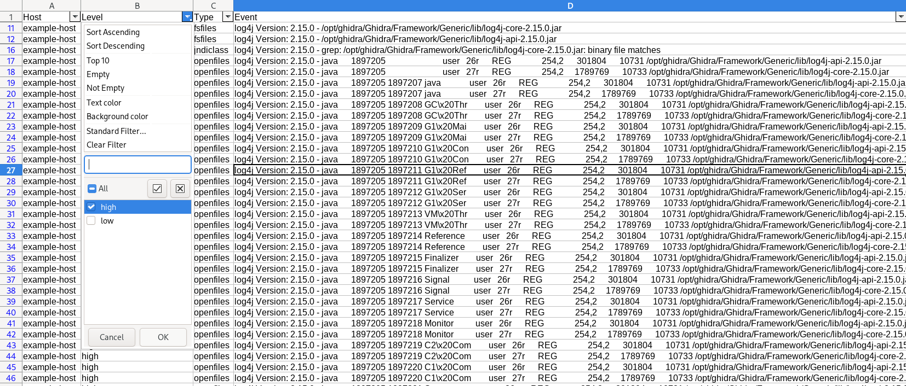
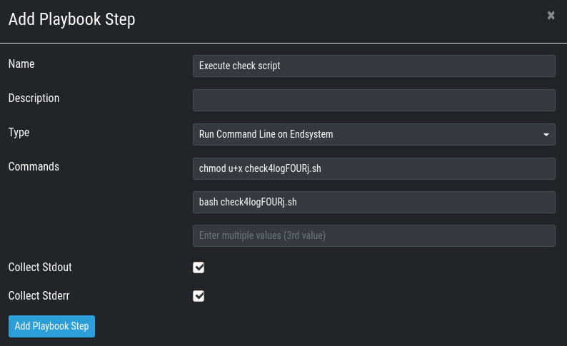
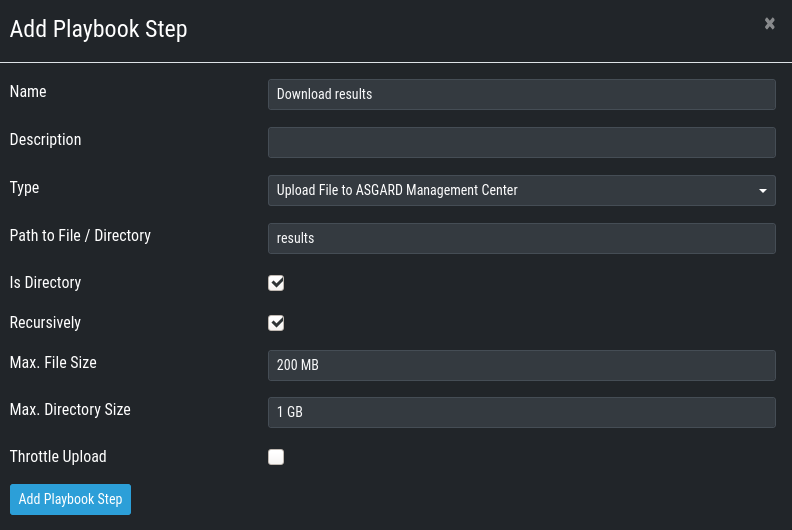
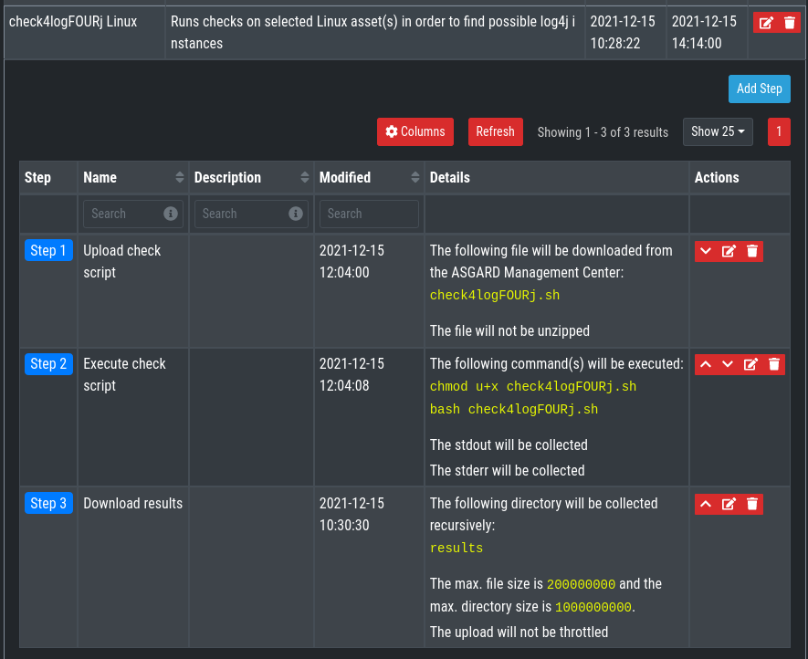
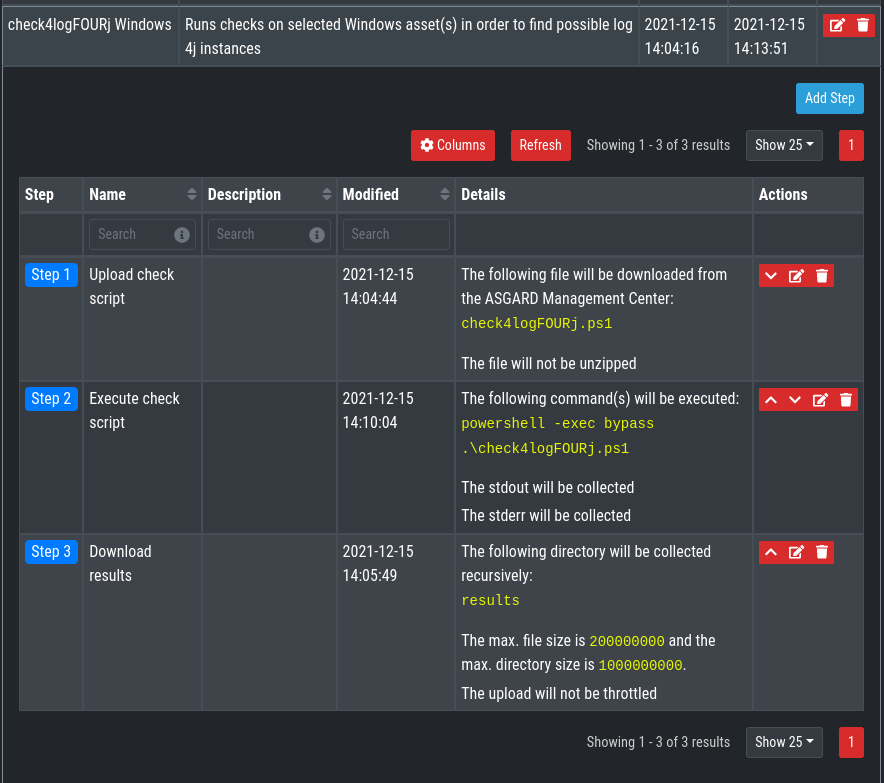

# Playbooks and Scripts for ASGARD to find (vulnerable) Log4j instances
We wrote scripts for Windows and Linux hosts to scan the host for traces of log4j to be used in ASGARD Management Center and a script to evaluate the results

## The Evalutation Script
The evaluation script can be found in this repository at [evaluation-script](evaluation-script). The script takes ZIP files generated by ASGARD Group Tasks (issued under Response Control)
and outputs as text directly on the commandline and offers flags to output json or csv files.

### Run a Group Task Example:

The evaluation script expects the results of the playbooks defined here. Also the script expects the results in a ZIP archive. So if you only plan to scan one system, scan it with a Group Task.


### Evaluation Script Examples

The help text:

```none
python evalPB.py --help
usage: evalPB.py [-h] [-v] [--json JSONPATH] [--csv CSVPATH] inputfile [inputfile ...]

Evaluate Playbook Results

positional arguments:
  inputfile        Input Zip file(s) downloaded from ASGARD Playbook

  options:
    -h, --help       show this help message and exit
    -v, --verbose    Also print low level events (not containing a vulnerable log4j2 version string)
    --json JSONPATH  Dump results into json with the given path
    --csv CSVPATH    Dump results into csv with the given path
```

Save output as CSV:

```none
python evalPB.py --csv log4j-inventory.csv results-1234.zip
```

Add verbose outputs (Does not filter out non-vulnerable versions, but therefore contains findings without any version string present):

```none
python evalPB.py --verbose --csv log4j-inventory.csv results-1234.zip
```

You can also add multiple playbook results (e.g. from Windows and Linux hosts)
```none
python evalPB.py --verbose --csv log4j-inventory.csv results-win.zip results-lin.zip
```



## Playbook Creation
Before you create the custom playbooks, you need to put some files into the `/var/lib/nextron/asgard2/playbook-files` directory:

1. The playbook scripts from this repo's [playbook-files](playbook-files)

You can either do that beforehand using scp, rsync, WinSCP or whatever tool you use for Linux file transfer. Do not forget to change the file ownership to **asgard2:asgard2**
(e.g. `chown asgard2: /var/lib/nextron/asgard2/playbook-files/check4logFOURj*`).

Or you can use the file upload feature during playbook creation:


### How to Create a Playbook
*This section explains how to create a playbook in detail. If you are familiar with ASGARD's playbook creation, see the overview of the next 2 sections.*

Go to **Response Control > Playbooks > Add Playbook**, enter
* Name: check4logFOURj Linux
* Description: Runs checks on selected Linux asset(s) in order to find possible log4j instances

and click **Add Playbook**.


Next add the single playbook steps. Therefore click anywhere on the newly created playbook to open its drop-down menu and then choose **Add Step** for each of the following Steps:

1. Upload check script

	- Choose the already uploaded script or select **Upload New File** if you want to upload it from the browser.
2. Execute check script

	- Commands 1: `chmod u+x check4logFOURj.sh`
	- Commands 2: `bash check4logFOURj.sh`
3. Download results 

    - Path to File / Directory: results
    - Check the 'Is Directory' box
    - Check the 'Recursively' box

### check4logFOURj Linux Playbook

Text for Copy-Paste:
* Name: check4logFOURj Linux
* Description: Runs checks on selected Linux asset(s) in order to find possible log4j instances
* Step 1:
	* Name: Upload check script
    * Type: Download File from ASGARD MC
* Step 2:
	* Name: Execute check script
    * Type: Run Command Line on Endsystem
    * Commands:
        - `chmod u+x check4logFOURj.sh`
        - `bash check4logFOURj.sh`
* Step 3:
	* Name: Download results
    * Type: Upload File to ASGARD MC
    * Path to File / Directory: results
    * Is Directory: checked
    * Recursively: checked

### check4logFOURj Windows Playbook

Text for Copy-Paste:
* Name: check4logFOURj Windows
* Description: Runs checks on selected Windows asset(s) in order to find possible log4j instances
* Step 1:
	* Name: Upload check script
    * Type: Download File from ASGARD MC
* Step 2:
	* Name: Execute check script
    * Type: Run Command Line on Endsystem
    * Commands:
        - `powershell -exec bypass .\check4logFOURj.ps1`
* Step 3:
	* Name: Download results
    * Type: Upload File to ASGARD MC
    * Path to File / Directory: results
    * Is Directory: checked
    * Recursively: checked
