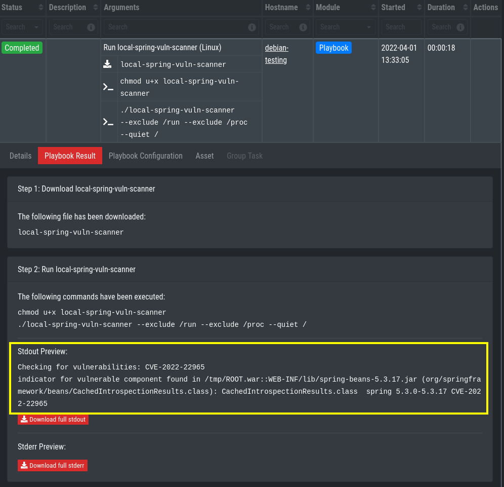
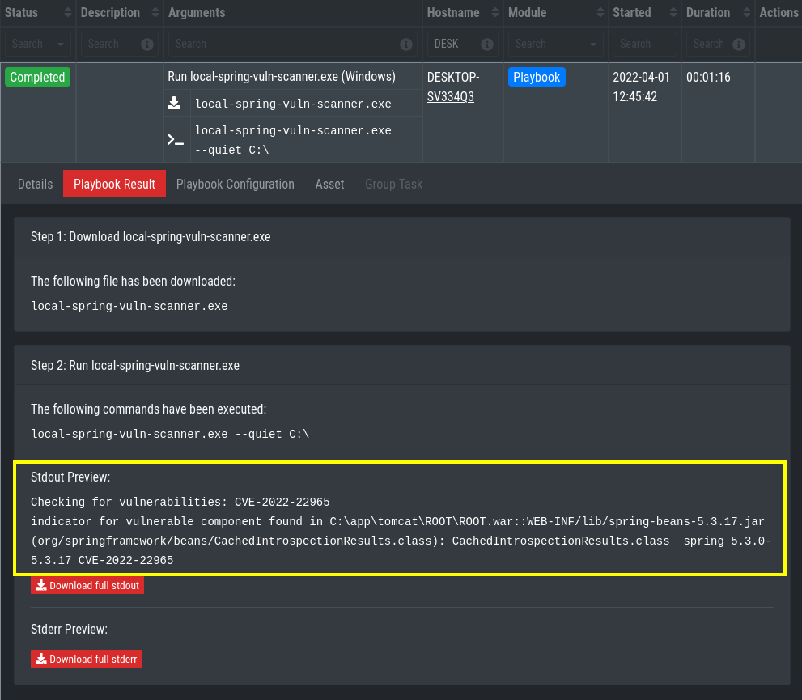

# Playbooks for ASGARD to find Spring's CVE-2022-22965 vulnerability
These playbooks make use of hillu's vulnerability scanner. The binaries can be downloaded from the github page: https://github.com/hillu/local-spring-vuln-scanner/releases

## Playbook Creation
For the playbooks to work some files need to be put into the `/var/lib/nextron/asgard2/playbook-files` directory of ASGARD:

1. The scanner binaries from hillu's github https://github.com/hillu/local-spring-vuln-scanner/releases

You can use the file upload feature during playbook creation to achieve that:

If you need to edit or update the files, you can do that using scp, rsync, WinSCP or whatever tool you use for Linux file transfer. Do not forget to change the file ownership to **asgard2:asgard2**
(e.g. `chown asgard2: /var/lib/nextron/asgard2/playbook-files/check4logFOURj*`), if it was changed by uploading.

### How to Create a Playbook
*This section explains how to create a playbook in detail. If you are familiar with ASGARD's playbook creation, see the overview of the next 2 sections.*

Go to **Response Control > Playbooks > Add Playbook**, enter
* Name: Run local-spring-vuln-scanner (Linux)
* Description: Runs local-spring-vuln-scanner on Linux asset(s).

and click **Add Playbook**.

Next add the single playbook steps. Therefore click anywhere on the newly created playbook to open its drop-down menu and then choose **Add Step** for each of the following Steps:

1. Download local-spring-vuln-scanner

- Choose the already uploaded script or select **Upload New File** if you want to upload it from the browser.

2. Execute check script

- Commands 1: `chmod u+x local-spring-vuln-scanner`
- Commands 2: `./local-spring-vuln-scanner --exclude /run --exclude /proc --quiet /`
    
### Overview - Run local-spring-vuln-scanner (Linux) Playbook

Text transcription of the screenshot:
* Name: Run local-spring-vuln-scanner (Linux)
* Description: Runs local-spring-vuln-scanner on Linux asset(s).
* Step 1:
	* Name: Download local-spring-vuln-scanner
    * Type: Download File from ASGARD MC
* Step 2:
	* Name: Run local-spring-vuln-scanner
    * Type: Run Command Line on Endsystem
    * Commands:
        - `chmod u+x local-spring-vuln-scanner`
        - `./local-spring-vuln-scanner --exclude /run --exclude /proc --quiet /`

### Overview - Run local-spring-vuln-scanner.exe (Windows) Playbook

Text transcription of the screenshot:
* Name: Run local-spring-vuln-scanner.exe (Windows)
* Description: Runs local-spring-vuln-scanner.exe on Windows asset(s).
* Step 1:
	* Name: Download local-spring-vuln-scanner.exe
    * Type: Download File from ASGARD MC
* Step 2:
	* Name: Run local-spring-vuln-scanner.exe
    * Type: Run Command Line on Endsystem
    * Commands:
        - `local-spring-vuln-scanner.exe --quiet C:\`

## Expected Playbook Results

The following two screenshots show the output of a vulnerable system.

### Linux

### Windows

